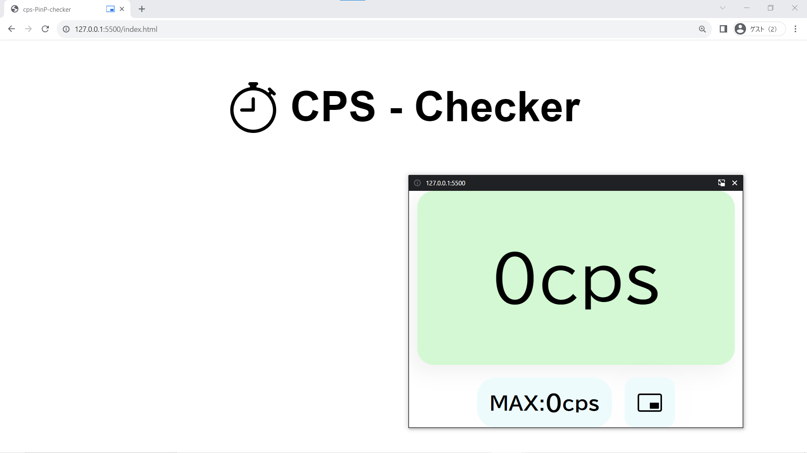

# PinP CPS Checker
**Picture-in-Picture** で使えるCPS測定器(クリック速度計測器)です。 

## 機能
- Picture-in-Picture機能を使ってゲーム中にもCPSが測定できます。
- 最大CPSの表示

## ライセンス
[MIT](LICENSE)

## 謝辞
- Bootstrapのアイコンを利用させていただいています。  
([MIT License](https://github.com/twbs/bootstrap/blob/413894d4691b5ebb1377fcf5ab8fd3bba49766a8/LICENSE);
Copyright: The Bootstrap Authors)